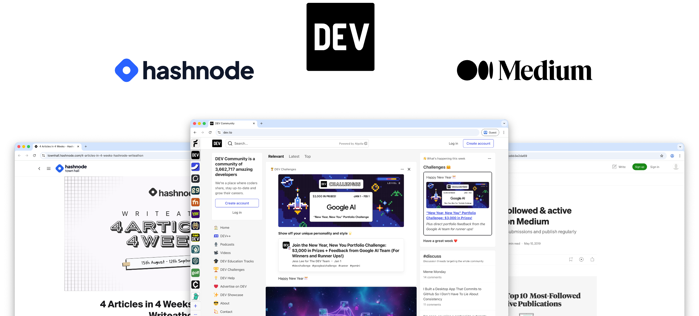
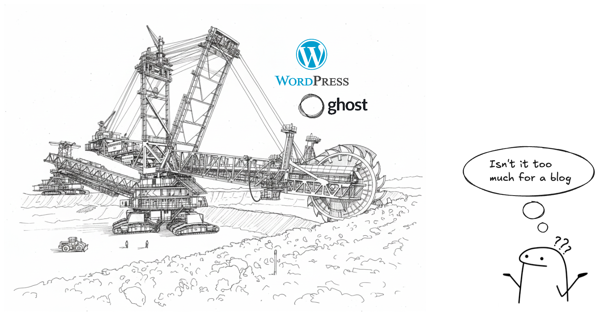
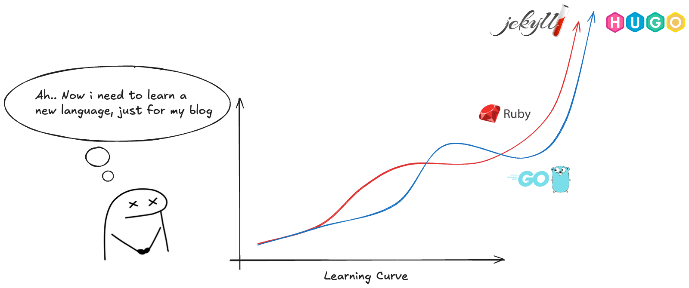
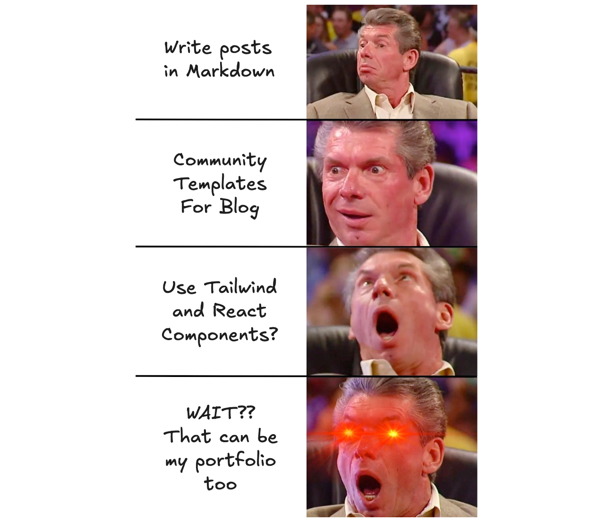
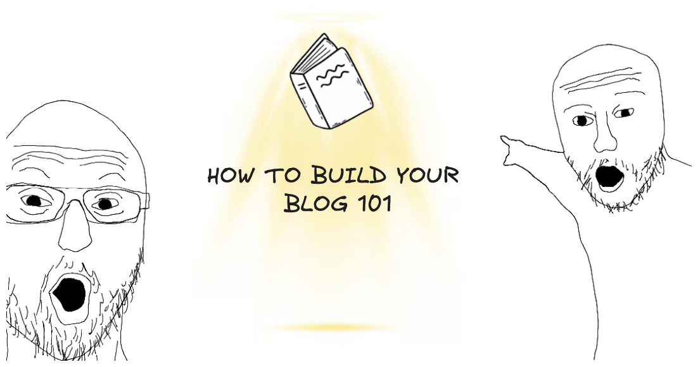
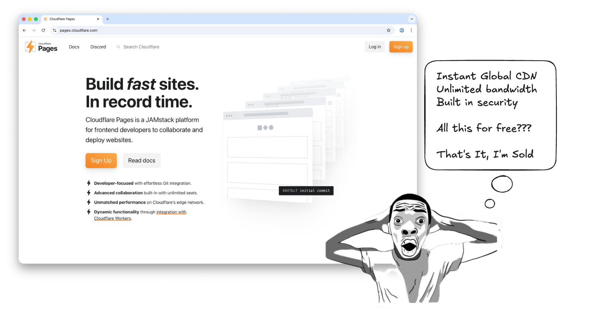

import Callout from '@/components/Callout.astro'

## How it all started

You know that feeling when you find something so cool, you have to tell someone? That was me a few weeks back. My first instinct? grab a few screenshots, head straight to Linkedin and hit post.

But something felt off. The post went live, got a few likes, and then... it disappeared into the endless scroll. That's when it hit me: what was I really trying to achieve here? A LinkedIn post has a shelf life of about 24 hours before it becomes digital dust. If someone needed this information next week, next month, or next year, how would they find it? The answer was clear: they wouldn't.

## The Search For Something Better

After days of hopping between platforms, I realized I needed something structured, flexible, and more findable in this vast internet. I started where everyone does - popular blogging platforms. They were polished, powerful, easy to use, packed with features like SEO optimization, clean typography and much more.

Some of the hosted solution I found are : [Medium](https://medium.com/) / [Dev.to](https://dev.to/) / [Hashnode](https://hashnode.com/)

These are some really awesome sites, but they all felt kinda same, polished, yet not personal. So somewhere along the way, I stopped chasing **The Best Blog** 🏆, I just wanted **my** blog, even if it was a simple one.

## Finding Astro

I explored a few self-hostable options like [Ghost](https://ghost.org/), [WordPress](https://wordpress.com/blog/) and a whole world of static site generators like [Jekyll](https://jekyllrb.com/), [Hugo](https://gohugo.io/). 

Ghost and Wordpress are powerful and feature packed - but heavy for my use case. 

Jekyll & Hugo were tempting, fast and popular - but unfamiliar (Ruby & Go). That meant an extra learning curve I wasn't ready to climb.

<Callout variant="note">
Honestly, they’re excellent tools, but they didn’t quite fit what I needed for this one.
</Callout>

After a long search, I stumbled upon [Astro](https://astro.build/) - a modern static site framework that generates content directly from Markdown files, which I thought was super cool, since I was already using [Obsidian](chatgpt://generic-entity?number=5) (that’s a story for another blog 😅). I was impressed right away.

While digging deeper into Astro-based blogging setups, I found an awesome repo [astro-erudite](https://github.com/jktrn/astro-erudite) which was opinionated - but in a good way. Clean structure, sensible defaults, and just enough constraints to keep things elegant. I liked it immediately and started tinkering with it.

After a few sleepless nights, I'd shaped it to fit my own needs - learning Tailwind and Astro along the way.

And here it is: my own blog and portfolio, built exactly the way I wanted. [Live Here!](/)

## Building Your Own Blog

Honestly, as I'm a backend guy and wanted a fast solution, so I picked this template as a good starting point. If you’re thinking about building your own site, here’s a no-nonsense path that works well:
### 1. Decide your goal
Blog? Portfolio? Both? Don't over-scope it - Be clear on what you want.
### 2. Pick a starting point
1. Use a template if you wanna move fast (like me)
2. Build one from scratch, if you enjoy design and setup
3. Use a CMS if writing is your only priority
### 3. Choose a stack you're comfortable with
Familiar tools reduce friction. Static generators like [**Astro**](https://astro.build/) are a great balance between flexibility and simplicity.
### 4. Write in Markdown
It’s portable, future-proof, and keeps content separate from presentation. 
### 5. Iterate Slowly
Add features only when you feel the need. **A plain site you ship today is better than a perfect one running in your localhost.**

## How (and Where) to Host It?

Once your site is ready, the next big question is: **where does it live?**

For now, I went with [**Cloudflare Pages**](https://pages.cloudflare.com/). It’s fast, generous with its free tier, and removes almost all the friction from deploying a static site. Push to Git, and your site is live—no servers, no maintenance, no stress. 

As a bonus, it had excellent with Astro, making the whole build-and-deploy flow feel effortless. 

Here are a few alternate options :
- [Vercel](https://vercel.com/) - Great dev experience, free tier
- [Netlify](https://netlify.com/) - Easy deployment, free tier available
- [GitHub Pages](https://pages.github.com/) - Free for public repos
- **Self-hosting** - Full control (Planning to move here soon)

The good news? For a personal blog or portfolio, **any of these free tiers are more than enough**. Pick the one that helps you get online fastest - you can always switch later.

## The Result

So yeah, finally here's the first version after a few sleepless nights and a plenty of tinkering.

It's not perfect and it doesn't has to be. It's **mine**.

If you find some bugs here and there, kindly drop an email to [theinfinull@gmail.com](mailto:theinfinull@gmail.com).

<Callout variant="important">
If you're thinking about starting your own blog, just do it. Pick a template, customize it, deploy it, and start writing. The best time to start was yesterday, the second best time is now. ☺️
</Callout>

Thanks for reading this!
